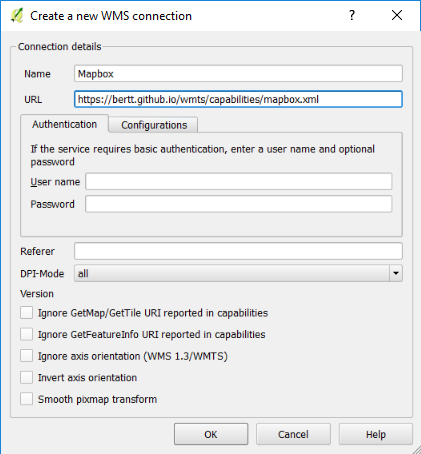
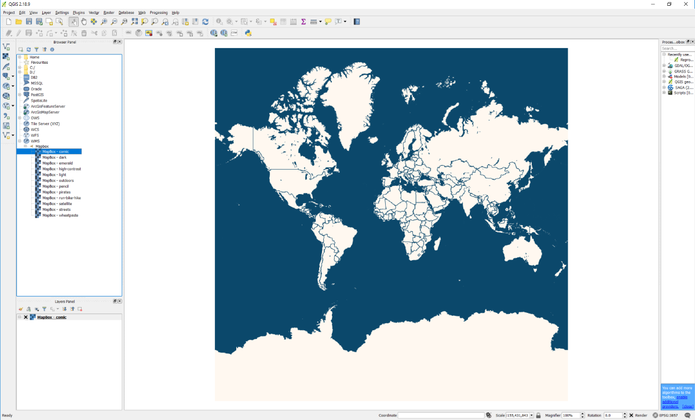

# bertt/wmts

Collection of WMTS services. Sample viewer see <a href="https://bertt.github.io/wmts/">https://bertt.github.io/wmts/</a>

For other applications: 

Sample retrieving capabilities files on github.io:

```
$ curl https://bertt.github.io/wmts/capabilities/mapbox.xml
```

QGIS Instructions:

Browser panel -> WMS -> New Connection



Select layer




